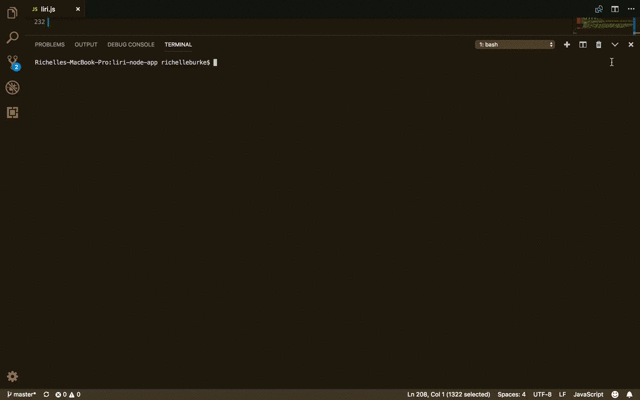
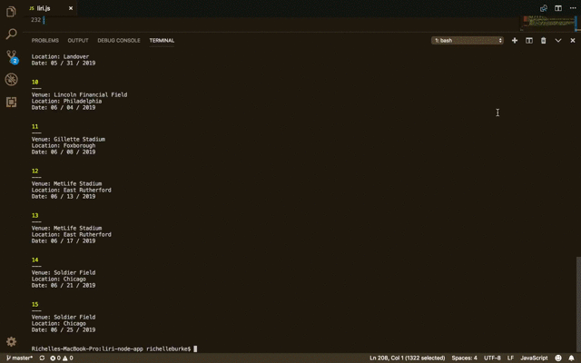
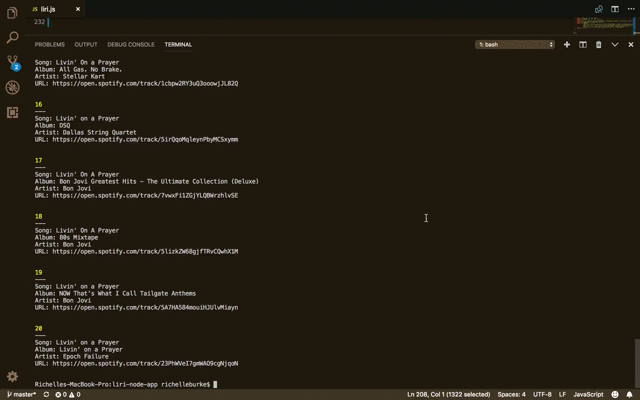
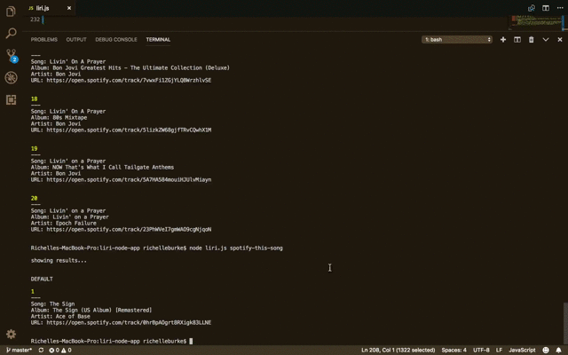

<pre>Hello my name is...

##        ##    ######     ##
##        ##    ##   ##    ##
##        ##    #####      ##
##        ##    ##   ##    ##
#######   ##    ##    ##   ##

----------------------------------

L.I.R.I stands for Language Interpretation and Recognition Interface. I may not be 
as vocal as my sister, Siri, but I can still grant you access to a plethora of data.

----------------------------------

Please enter a command to get started.</pre>

<pre>COMMANDS:

concert-this: Enter 'node liri.js concert-this <band name>' to find info on bands playing near you.</pre>

<pre>spotify-this-song: Enter 'node liri.js spotify-this-song <song name>' to find spotify info on your favourite song.</pre>

<pre>movie-this: Enter 'node liri.js movie-this <movie name>' to find info on your a movie.</pre>

<pre>do-what-it-says: Enter 'node liri.js do-what-it-says' for a random command.</pre>

<pre>----------------------------------</pre>